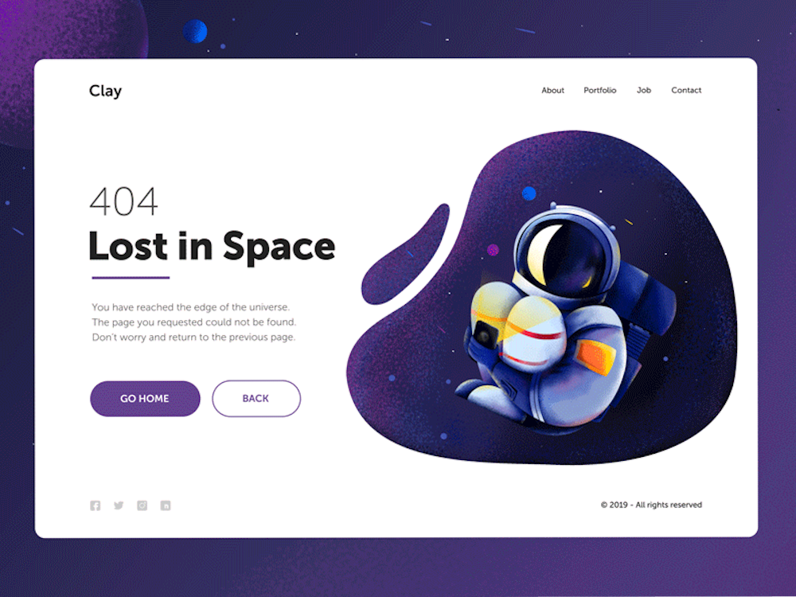

[](https://discord.gg/dRwW4rw)

# Astronautas 

_website design project_

<br>

## 🌟 About

This project is for educational porpuses only. Pull request are welcome, but priority for project authors! Thank you for your cooperation!

Site published at:https://principess01.github.io/astronautas/

Design: 

## 🎯 Project features/goals

-   Github pages
-   no responsive design
-   CSS file
-   FontAwesome icons
-   display: flex
- favicon
-   hover state
-   bash commands:
 - `touch index.html` (sukuria failą)
 - `touch failas1.txt failas2.txt` 
 - `mkdir img` (sukuria folderi/direktorija)
 - `mkdir folder1 folder2`
 - `ls -al` (stulpeliu atvaizduoja direktorijoje esantį turinį)
 - `rm failo.pavadinimas`
- git commands:
 - `git init`
 - `git add .`
 - `git commit -m "Message text"`
 - `git push`
ls
Node.js - _download and install_

```
https://nodejs.org
```

Git - _download and install_

```
https://git-scm.com
```

### 🏃 Run locally

Would like to run this project locally? Open terminal and follow these steps:

1. Clone the repo
    ```sh
    git clone https://principess01.github.io/astronautas.git
    ```
2. Install NPM packages
    ```sh
    npm i
    ```
    or
    ```sh
    npm install
    ```
3. Run the server
    ```sh
    npm run dev
    ```

### 🧪 Running tests

There is no tests for this project.

## 🎅 Authors

Aurelija: [Github](https://github.com/principess01)

## ⚠️ License

Distributed under the MIT License. See LICENSE.txt for more information.

## 🔗 Other resources

No other resources.